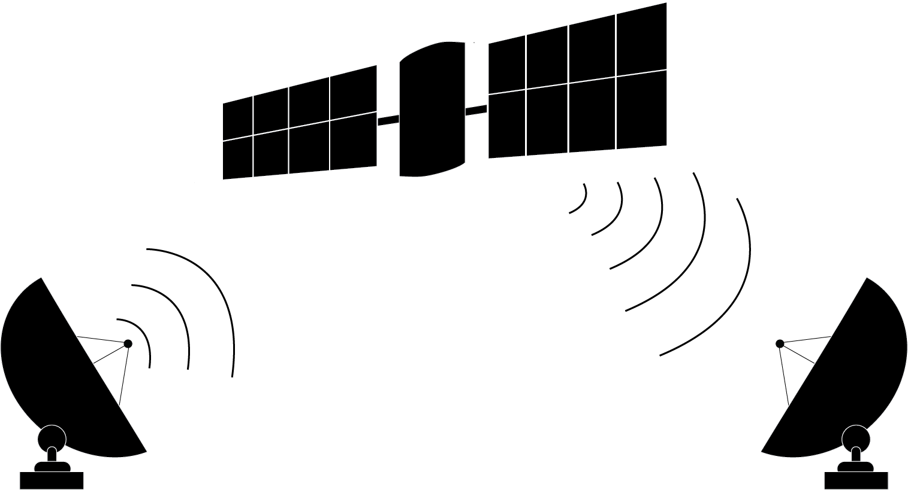
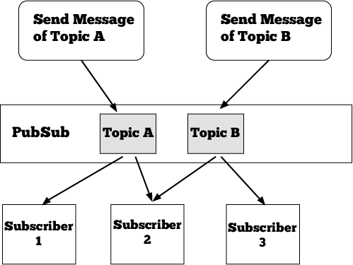

# Event-Driven Architecture

Yosai features an event-driven architecture where events emitted during
authentication, authorization, and session management trigger subsequent
processing.

Events are communicated using a publish-subscribe paradigm.  An event publisher
emits the event to a channel (an internal Event Bus) that relays the event to
consumers who have subscribed to the event's topic. The EventBus is a singleton
shared throughout the running instance of Yosai.

An EventBus relays published events to event subscribers and provides a mechanism for
registering and unregistering event subscribers. With this pubsub paradigm,
components can publish or consume events without tightly coupling consumers to
producers.  This promotes flexibility through loose coupling and high cohesion
between components, leading to a more pluggable architecture.

## Sending Events
If a component wishes to publish events to other components:
`event_bus.publish(topic, *kwargs)`

The event bus dispatches the event 'message' to components that wish to receive
events of that type (known as subscribers).

## Receiving Events
A component can receive events of interest by doing the following.

For each event topic you wish to consume, create a callback method
that will be called when an specific type of event is communicated across
the event bus.  Register the callback with the event_bus:
`event_bus.register(topic, callback)`

## Event Schedule
The following table lists the Events that are used in Yosai, who the
publisher of an event is, and who the subscriber(s) are:

| Event Topic              | Publisher  | Subscriber(s) |
|--------------------------|------------|---------------|
| SESSION.START            | SEH        | EL            |
| SESSION.STOP             | SEH        | MRA, EL       |
| SESSION.EXPIRE           | SEH        | MRA, EL       |
| AUTHENTICATION.SUCCEEDED | DA         | MRA, EL       |
| AUTHENTICATION.FAILED    | DA         | EL            |
| AUTHORIZATION.GRANTED    | MRA        | EL            |
| AUTHORIZATION.DENIED     | MRA        | EL            |
| AUTHORIZATION.RESULTS    | MRA        | EL            |

- DA = ``yosai.core.authc.authc.DefaultAuthenticator``
- EL = ``yosai.core.event.event.EventLogger``
- MRA = ``yosai.core.authz.authz.ModularRealmAuthorizer``
- SEH = ``yosai.core.session.session.SessionEventHandler``

## Event Logging

Communicating events in a structured format facilitates processing of log
entries by systems independent of Yosai.  Therefore, events are
logged in a structured format by reducing event payloads to their serializable
form using ``marshmallow``.

In addition to reducing payloads using marshmallow, Yosai includes an optional
logging module that features JSON encoded formatting.  It is highly recommended
that you use it or another structured format for logging events.
