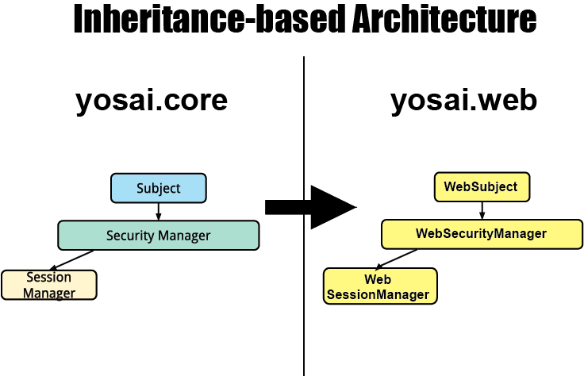

# Web Integration

This section of documentation is dedicated to ``yosai.web``.  

When you install Yosai from PyPI (using the pip installer), you are installing
a package that includes ``yosai.core``, featuring the framework and a "native"
library, and ``yosai.web``, which extends ``yosai.core`` to support web applications.

Web development is so popular that it makes sense to include support for it
from the main Yosai project package.  Further, this approach is consistent with that
taken by the Apache Shiro project.


## Architectural Overview

Yosai enables web support by extending, through inheritance, a few of the key
components (and sub-components), in its architecture:



These components are extended to support interaction with a web-specific API, known
as a ``WebRegistry`` API, that manages a web application's cookies
used to track SessionID and RememberMe and manages other related attributes.


## Web Registry API

``yosai.web`` is designed for integration with any kind of web application.  
It can integrate with any application framework, such as Django, Pyramid, Flask,
or Bottle.  This is made possible through application-specific implementations of
the WebRegistry API.  

The WebRegistry API is an interface, specified by an abstract base class (like the
rest of the interfaces defined in Yosai). For instance, a ``pyramid_yosai`` integration
consists of a PyramidWebRegistry implementation, a ``django_yosai`` integration
consist of a DjangoWebRegistry, etc.


## Initializing Web-enabled Yosai

Instantiating a web-enabled instance of Yosai follows the same process as
instantiating a native Yosai instance except that web-enabled classes are
used instead:

```Python
from yosai.web import WebSecurityUtils, WebSecurityManager

security_manager = WebSecurityManager(realms=(realm,),
                                      cache_handler=DPCacheHandler(),
                                      session_attributes_schema=AttributesSchema)
yosai = WebSecurityUtils()
yosai.security_manager = security_manager
```

## Using a Web-enabled Yosai

Create a new ``WebRegistry`` instance.  Then, when using a web-enabled Yosai,
such as that created above, you pass a ``WebRegistry`` argument to it
as you open a new context:

```Python

with yosai(web_registry):
    issue_prescription(patient)

    for prescription in get_prescription_refill_requests(patient):
        issue_prescription(patient, prescription)

```
