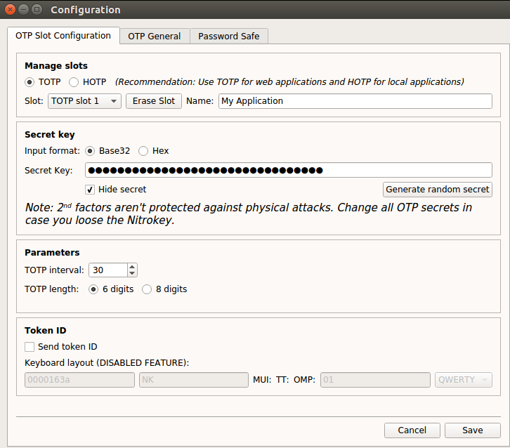

+++
chapter = true
date = "2016-11-20T15:26:06-05:00"
icon = "<b>X. </b>"
next = "/next/path"
prev = "/prev/path"
title = "index"
weight = 0

+++

# One-Time Password User Setup

You will perform the following steps to enable a user for TOTP second-factor authentication:
- Create a TOTP Factory
- Use the TOTP Factory to generate a new TOTP instance
- Create an encrypted and json-serialized form of the TOTP instance
- Obtain the private totp key
- Share the private totp key with the user
- Persist the encrypted, serialize totp key to long term storage (database)

-----------------------------------------------------------------------

# Create a TOTP Factory

Create a TOTP factory by passing ``create_totp_factory`` **either** an *env_var*
**or** *file_path* keyword argument, just as you do when instantiating a Yosai instance.

!! It is important that the application creating TOTP instances uses the same configuration as Yosai to verify tokens.

```python
>>> from yosai.core import create_totp_factory

# you can pass EITHER an environment_variable OR filepath:
>>> TOTPFactory = create_totp_factory(env_var='YOSAI_SETTINGS')
```

-----------------------------------------------------------------------

# Use the TOTP Factory to generate a new TOTP instance

Generate a new TOTP instance for a user by calling TOTPFactory.new().

```python
>>> totp = TOTPFactory.new()
```


-----------------------------------------------------------------------

# Create an encrypted and json-serialized form of the TOTP instance

```python
>>> totp.to_json()
'{"enckey":{"c":14,"k":"FENAUW5P6VICNS6C2ODIMJT7QNJMN2RU","s":"G5TMYOMHODXB2Q3IBWQQ","t":"1479726717783","v":1},"type":"totp","v":1}'
```

-----------------------------------------------------------------------

# Obtain the private totp key

The TOTP instance can format the key in a few ways:  in base32, hex, or a
"pretty" base32.

```python
>>> totp.base32_key
'HXTRYI7EPSX3LVQ2EPCFQSYJIHENTG5T'

>>> totp.hex_key
'3de71c23e47cafb5d61a23c4584b0941c8d99bb3'

>>> totp.pretty_key()
'HXTR-YI7E-PSX3-LVQ2-EPCF-QSYJ-IHEN-TG5T'
```

-----------------------------------------------------------------------

# Share the private totp key with the user.

How or whether you share the private totp key with the user will depend on what
facilities you want to support for TOTP authentication.  If you decide to
use SMS-based TOTP authentication, you don't ever share the private key with the user.

## Secure USB


If a user is using a USB dongle, such as a Nitrokey, the hardware is accompanied
with management software that saves the private totp key to USB memory.  A user will copy/paste
the key into the software's interface and save the record to memory.


To facilitate this method of storage, share the key as a string, either in base32 or hex format.



## QR Code


If a user is using a mobile application, such as Google Authenticator, the
application can read the private key as a QR code.  ``passlib.totp`` facilitates
QR code generation.  Consult [its documentation](https://passlib.readthedocs.io/en/latest/narr/totp-tutorial.html#rendering-uris) to learn how.
-----------------------------------------------------------------------

# Persist the encrypted, serialize totp key to long term storage (database)


